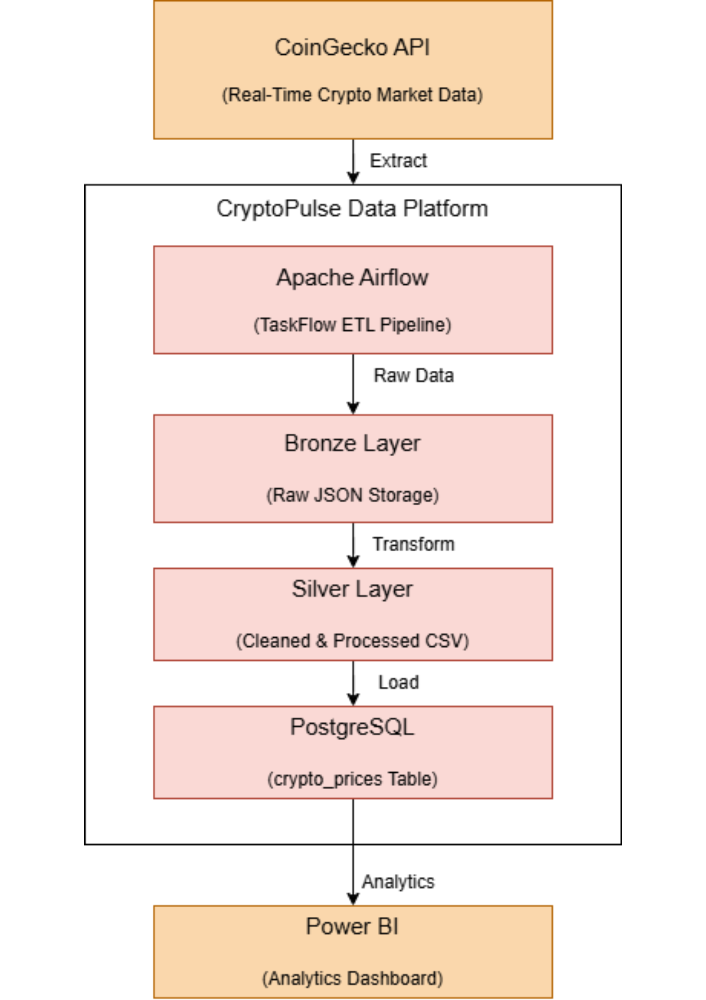

# CryptoPulse: End-to-End Cryptocurrency Market Data Platform

## Project Overview

CryptoPulse is an end-to-end data engineering project that automates the collection, processing, storage, and visualization of cryptocurrency market data.

The platform extracts real-time cryptocurrency data from the CoinGecko API, processes it through an Apache Airflow ETL pipeline, stores historical records in PostgreSQL, and delivers business insights through interactive Power BI dashboards.

The primary objective of this project is to demonstrate modern data engineering practices including workflow orchestration, data transformation, historical data storage, automation, and analytics reporting.

---

## Business Problem

Cryptocurrency markets generate large volumes of rapidly changing data. Analysts, traders, and decision-makers require a reliable way to collect market information, track historical performance, and monitor trends over time.

CryptoPulse addresses this challenge by building an automated data pipeline that transforms raw cryptocurrency market data into analytics-ready datasets.

---

## Solution Architecture

### Data Flow

CoinGecko API → Apache Airflow → Bronze Layer → Silver Layer → PostgreSQL → Power BI

### Architecture Components

**Data Source**

* CoinGecko API provides real-time cryptocurrency market data.

**Orchestration Layer**

* Apache Airflow schedules and orchestrates ETL workflows using the TaskFlow API.

**Bronze Layer**

* Stores raw JSON responses from the API for auditability and reprocessing.

**Silver Layer**

* Cleans, validates, and standardizes the dataset into an analytics-ready format.

**Storage Layer**

* PostgreSQL stores historical cryptocurrency market data.

**Analytics Layer**

* Power BI provides interactive dashboards and trend analysis.

---

## Architecture Diagram


```markdown


```

---

## Technologies Used

| Technology       | Purpose                   |
| ---------------- | ------------------------- |
| Python           | Core development language |
| Apache Airflow 3 | Workflow orchestration    |
| PostgreSQL       | Data storage              |
| Docker           | Containerization          |
| Pandas           | Data transformation       |
| SQLAlchemy       | Database connectivity     |
| CoinGecko API    | Data source               |
| Power BI         | Data visualization        |

---

## Project Structure

```text
cryptopulse/
│
├── dags/
│   └── crypto_pipeline_dag.py
│
├── src/
│   ├── extract.py
│   ├── transform.py
│   ├── load.py
│   └── config.py
│
├── sql/
│   └── create_tables.sql
│
├── data/
│   ├── bronze/
│   └── silver/
│
├── dashboard/
│   └── CryptoPulse.pbix
│
├── screenshots/
│   ├── architecture.png
│   ├── airflow_success.png
│   └── dashboard.png
│
├── requirements.txt
├── docker-compose.yml
├── .gitignore
└── README.md
```

---

## ETL Pipeline

### Extract

The extract layer retrieves cryptocurrency market data from the CoinGecko API and stores the raw JSON response in the Bronze layer.

### Transform

The transform layer:

* Selects relevant fields
* Cleans the dataset
* Standardizes column names
* Creates historical timestamps
* Produces analytics-ready data

### Load

The load layer inserts transformed records into PostgreSQL using an append strategy, enabling historical tracking of cryptocurrency metrics over time.

---

## Key Features

* Automated ETL pipeline using Apache Airflow
* Historical cryptocurrency price tracking
* Dockerized deployment environment
* PostgreSQL analytical storage
* Power BI interactive dashboards
* Modular and maintainable project structure
* Bronze/Silver data architecture

---

## Dashboard Insights

The Power BI dashboard provides:

### Executive Overview

* Total Market Capitalization
* Total Trading Volume
* Number of Cryptocurrencies
* Average Daily Price Change

### Market Analysis

* Top Cryptocurrencies by Market Capitalization
* Trading Volume Distribution
* Market Performance Comparison

### Historical Analysis

* Cryptocurrency Price Trends
* Market Capitalization Trends
* Volume Trends
* Coin-Level Performance Tracking

Add dashboard screenshots below:

```markdown

```

---

## Running the Project

### Clone the Repository

```bash
git clone <repository-url>
cd cryptopulse
```

### Install Dependencies

```bash
pip install -r requirements.txt
```

### Start Services

```bash
docker compose up -d
```

### Launch Airflow

Open:

```text
http://localhost:8080
```

Trigger the DAG:

```text
crypto_pipeline
```

---

## Lessons Learned

This project provided hands-on experience with:

* Building production-style ETL pipelines
* Workflow orchestration with Apache Airflow
* Historical data modeling
* PostgreSQL database design
* Docker containerization
* Business intelligence reporting
* Data pipeline troubleshooting and monitoring

---

## Future Enhancements

Planned improvements include:

* AWS S3 Data Lake integration
* Apache Spark transformations
* Parquet-based storage
* Amazon Redshift warehouse
* Data quality validation framework
* CI/CD automation
* dbt transformation layer
* Monitoring and alerting

---

## Author

Michael Okposo

𝐃𝐚𝐭𝐚 𝐄𝐧𝐠𝐢𝐧𝐞𝐞𝐫 | 𝐃𝐚𝐭𝐚 𝐀𝐧𝐚𝐥𝐲𝐭𝐢𝐜𝐬 | 𝐌𝐚𝐜𝐡𝐢𝐧𝐞 𝐋𝐞𝐚𝐫𝐧𝐢𝐧𝐠  | 𝐏𝐡𝐚𝐫𝐦𝐚𝐜𝐢𝐬𝐭

LinkedIn: http://linkedin.com/in/okposo-michael-b0b99224a

GitHub: Add your GitHub profile
